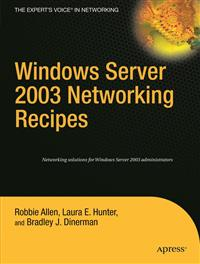

#Apress Source Code

This repository accompanies [*Windows Server 2003 Networking Recipes*](http://www.apress.com/9781590597132) by Robbie Allen, Beau Hunter, and Brad Dinerman (Apress, 2006).

Download the files as a zip using the green button, or clone the repository to your machine using Git.

##Releases

Release v1.0 corresponds to the code in the published book, without corrections or updates.

##Contributions

See the file Contributing.md for more information on how you can contribute to this repository.
